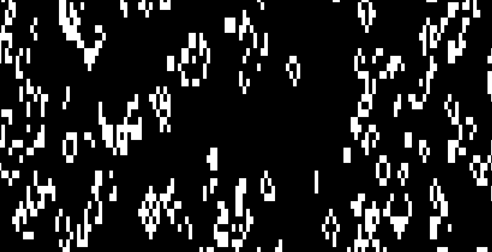
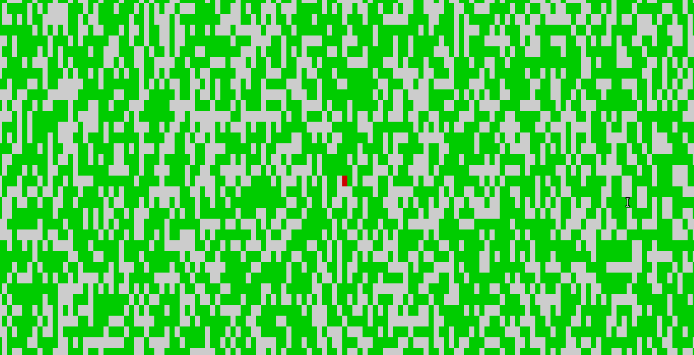
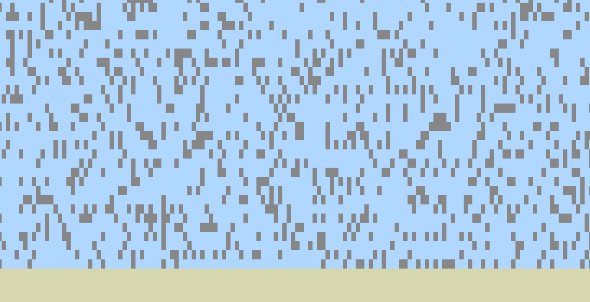

**WIP**

# Presentation

I invented a simple language for cellular automatons specification. Once you have written a file that describes the rules of your cellular automaton, the program will parse it and run it. For now I use the terminal to display the simulation, which is obviously not efficient, but I will switch to a real GUI in the future.



# How to build & use

This is a **RUST** project. You need to install [rustup](https://doc.rust-lang.org/book/ch01-01-installation.html) to build it. Then just use the following command to build and run the program :
```
cargo run <AUTOMATON>
```
Where AUTOMATON is the path to the file describing the rules of the cellular automaton. You can use the example files under the resources folder.

# The language

The language allows you to describe the possible states and the transitions that link them, as well as the settings of the "world" of the cellular automaton, like its size. Here is an example with the rules of the famous Conway's game of life :
```
size (200, 50)

states {
    (dead, 0, 0, 0),
    (alive, 255, 255, 255, proportion 0.2),
}

transitions {
    (alive, dead, alive < 2 || alive > 3),
    (dead, alive, alive == 3),
}
```
But this example does not demonstrate all the language functionalities (TODO document language).

The program includes a basic compiler that tells the user if there are errors in the automaton specification. It stops at the first syntax error, but if there are none, it can give all semantic errors at once.

Example of a lexical error :
```
Expected an integer between 0 and 255, found "123546" - line 4, column 20.
```

Example of a semantic error :
```
The transition 'dead -> aliveaaazerty' refers to the state "aliveaaazerty", but it's not defined.
```

# Automatons examples




# TODOs

* Make traits for inputs and display in order to allow different displays.
* avoid systematic camera's image memory reallocation
* document language
* add a save / load system to save a current state (and the associated automaton rules attached ?)
* multi-thread automaton tick & camera capture.
* add basic arithmetic (addition, subtraction) in language for conditions
* make the code in semantic.rs more readable
* add an error when two states have the same name
* extend language : add not operator

